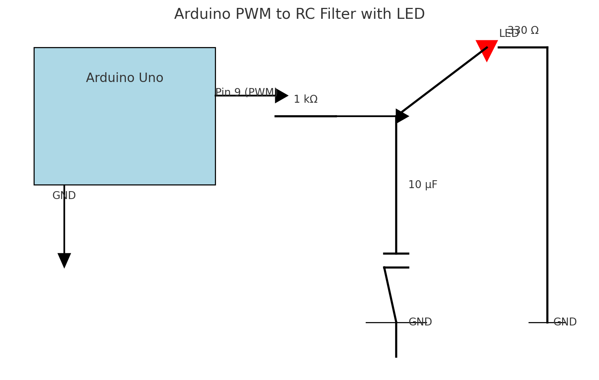

### Points importants :

1.  **Fonction exponentielle :** On utilise directement exp⁡(x)\exp(x)exp(x) et on la normalise pour atteindre 5V à la fin des 5 heures.
2.  **Intervalle :** L'intervalle d'1 seconde (1000 ms) offre une mise à jour fluide.
3.  **Tension PWM :** La fonction exponentielle est convertie en une plage de 0 à 255 pour piloter la broche PWM.

### Instructions :

1.  Chargez ce code dans votre Arduino.
2.  Connectez un multimètre ou un oscilloscope à la broche 9 PWM pour vérifier la tension.
3.  Si vous voulez une sortie analogique pure (sans fluctuations du PWM), ajoutez un filtre RC (par exemple, résistance 1 kΩ et condensateur 10 µF).

