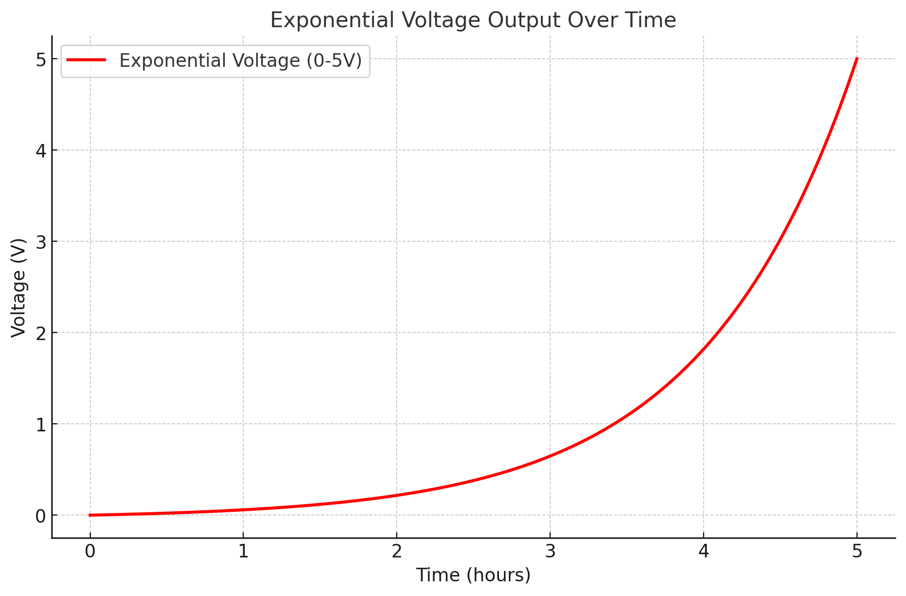

# Exponential Pump Control

**Author**: Andrew ZICLER  
**Year**: 2024  

## Description

This project controls an **INOFLUID** pump using an exponential voltage curve over time.  
It runs on an **Industruino** and outputs a 0–10V signal via the Indio module to dynamically regulate the pump flow rate.

The system allows:
- **Start/reset control** via physical buttons (A and B)
- **Exponential ramp** from 0 to 10V
- **Live voltage display** on a UC1701 LCD screen

Designed for experimental setups requiring precise and dynamic flow control.

---

## Hardware Requirements

- Industruino with Indio module  
- UC1701-compatible LCD display  
- INOFLUID pump (or any 0–10V-controlled device)  
- Two push buttons (Start and Reset)

---

## Usage

- Press **Start** (Button A): Begins an exponential voltage increase from 0 to 10V over a defined duration.
- Press **Reset** (Button B): Resets the voltage output to 0V.
- Voltage is updated every 100 ms and displayed in real-time.

---

## Adjusting the Duration

To change the duration of the exponential voltage ramp, modify the following line in the code:

```cpp
---
## wirering

[INOFLUID Pump]
   - Signal input  ---> Channel CH1 OUT (mapped to D22 via Indio module)
   - Controlled by a 0–10V analog output using:
       Indio.analogWrite(channel, voltage, false);

const unsigned long duration = 1 * 60 * 1000; // 1 minute in milliseconds


